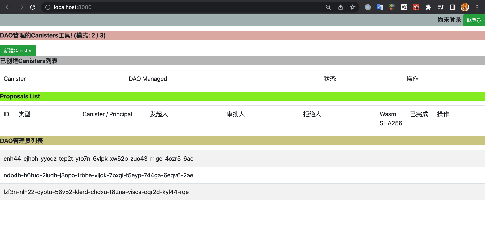
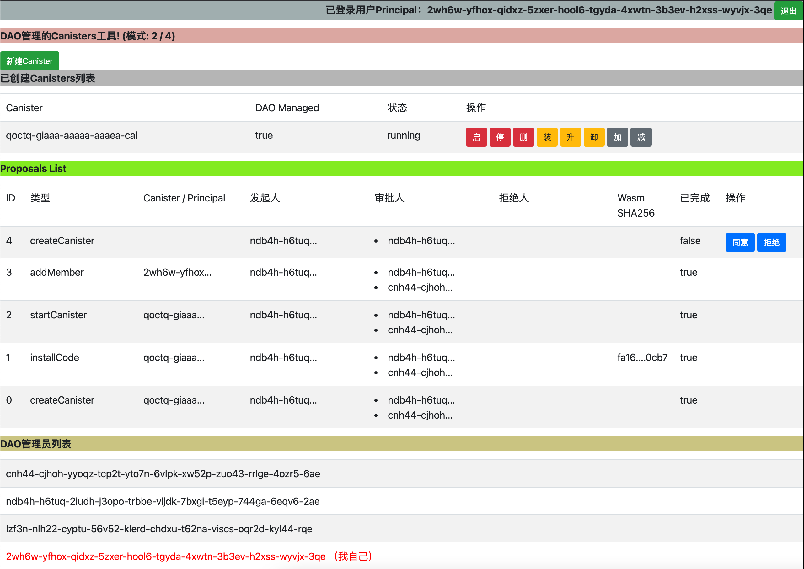
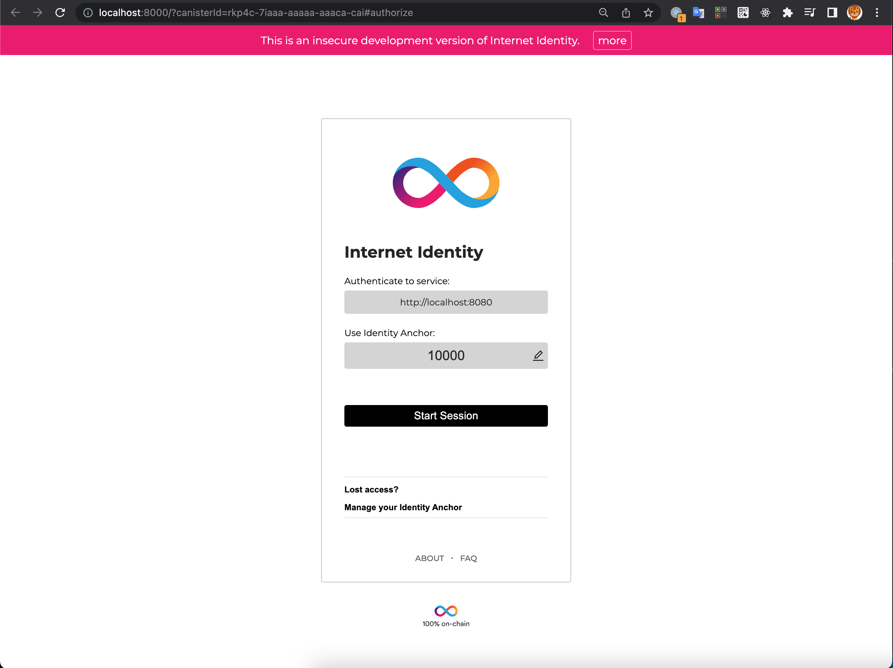
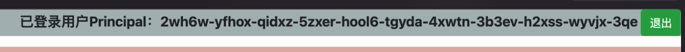
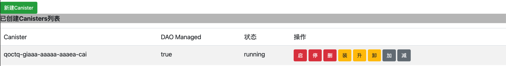
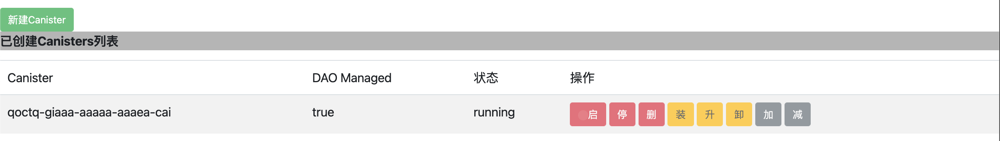
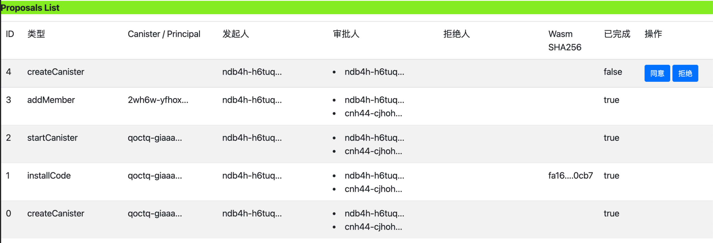
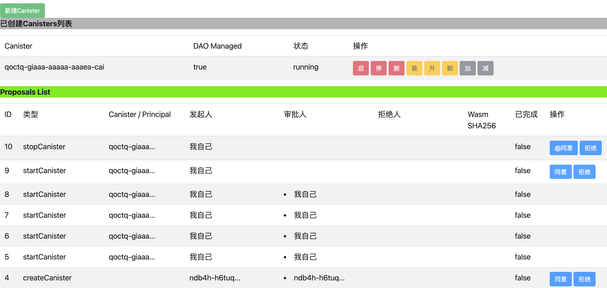
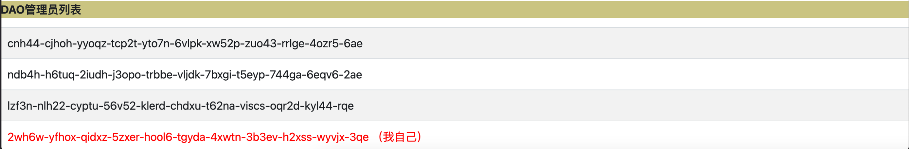
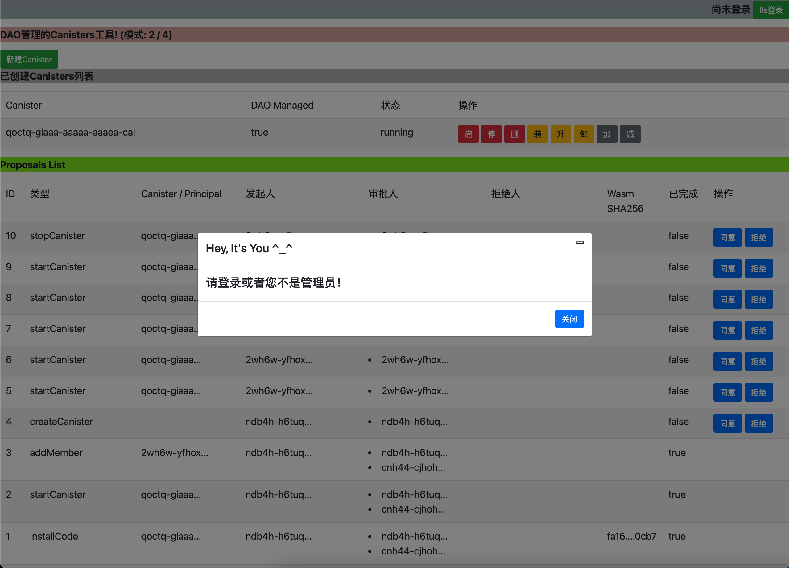

## 尚未登录的界面

## 登录后的界面

### II授权界面

点击登录后，会弹出II的授权界面；完成授权后，返回到登录后界面  

登录后的界面，会显示授权用户的principal

用户刷新网页，登录态会保持，实现了从local storage中恢复auth client

在登录态点击退出后，会删除local storage中的identity、delegation数据，回到初始态

### 管理模式板块

下一个板块，会在页面中显示DAO多签的模式，M/N(2/4)，意思就是总共有M(4)个管理员，其中任何N(2)个同意某个提议后，提议将会执行

### Canister板块

可以在该板块去创建新的Canister（需要先提议，再批准，按照模式）

该板块显示目前DAO管理的所有canister列表

- 列表显示了Canister的ID
- DAO Managed：表示该Cansiter是为DAO多签管理，缺省创建的canister都是多签管理；DAO可以通过“减”（减去权限）的多签操作，将DAO Managed设置为false；这样任何一个管理员都可以自己管理该Canister
- 状态：Canister在IC上的状态，取值为：running、stopped、stopping
- 操作
    - 红色部分，为Canister本身的操作：启动Canister、停止Cansiter、删除Cansiter
    - 黄色部分，为代码相关的操作：装载代码、升级代码、卸载代码
    - 灰色部分，为权限相关的操作：添加DAO多签权限、减去DAO多签权限

Canister板块的所有按钮操作，都实现了：
- 点击后，返回前，disable 所有按钮，置灰并且无法点击
- 点击后，返回前，当前操作的按钮，会显示加载动画，如上图“启动”按钮

### 提议板块

显示所有提议的列表，按照ID大小倒序显示的
- 提议ID
- 提议类型
    - createCanister：创建canister
    - startCanister：启动canister
    - stopCanister：停止canister
    - deleteCanister：删除canister
    - installCode：在canister中安装代码
    - upgradeCode：在canister中升级代码
    - uninstallCode：在canister中卸载代码
    - addPermission：提议canister为DAO多签管理模式
    - removePermission：提议canister为单个管理员管理模式
    - addMember：添加管理员，模式2/3在添加管理员后，变为：2/4
- Canister / Principal：提议的目标Canister ID，当提议是权限操作时，为Principal ID
- 发起人：提议发起人的Principal
- 审批人：同意该提议的管理员Principal列表，审批人达到M后，提议完成并执行相关操作
- 拒绝人：拒绝该提议的管理员Principal列表，拒绝人数达到N-M+1后，提议进入终止状态，相关操作不会执行
- WASM SHA256：当提议为安装代码、升级代码时，合约会计算WASM Code的SHA256；这个操作在链上执行非常耗时，最简单的greet合约，不到200
K，需要计算20多秒；这个为了让提议人、审批人都可以明确知道，未来会执行的代码是什么
- 已完成：审批完成、或者 拒绝终止，都会进入已完成状态
- 操作：当登录人的Principal是管理员之一时，可以进行操作：同意、拒绝；只有未完成、并且未操作过的提议，才会显示操作按钮

假设管理员A发起提议后，审批人数不会增加；需要A单独再次“同意”该提议，审批人数才会增加

提议管理的操作，“同意” 与 “拒绝”，会与前面canister管理版块的操作按钮，一起做限制：
- 点击后，返回前，disable 所有按钮，置灰并且无法点击
- 点击后，返回前，当前操作的按钮，会显示加载动画，如上图“同意”按钮

如果发起人、审批人、拒绝人，是当前用户 或者 包括当前用户，会显示“我自己”，如上图所示

### DAO管理员板块

DAO管理员板块显示当前所有管理员Principal列表，如果当前登录用户是某个管理员，会显示“我自己”

### 非操作员操作

如果当前登录用户不是管理员，或者不在登录态，那么点击任何操作后都会如上图提示
